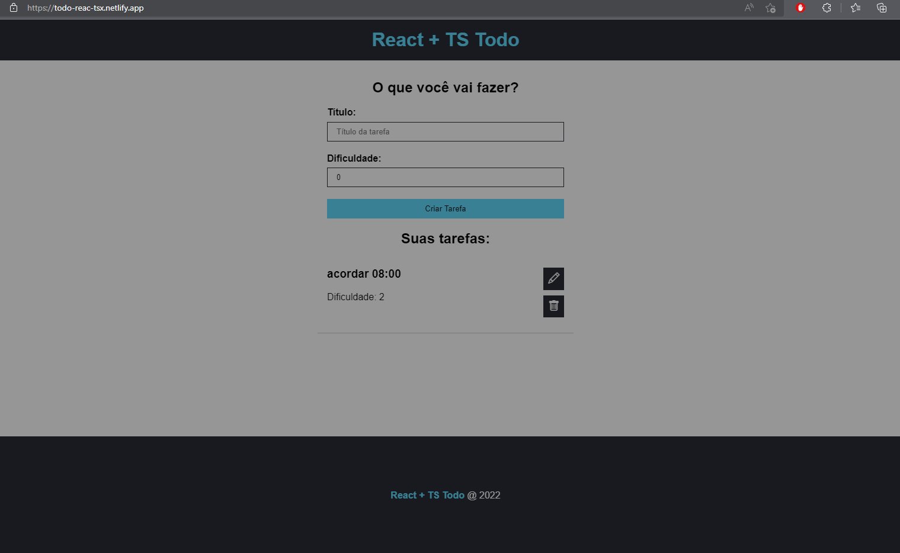
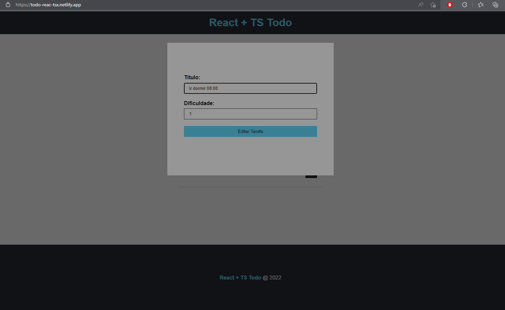
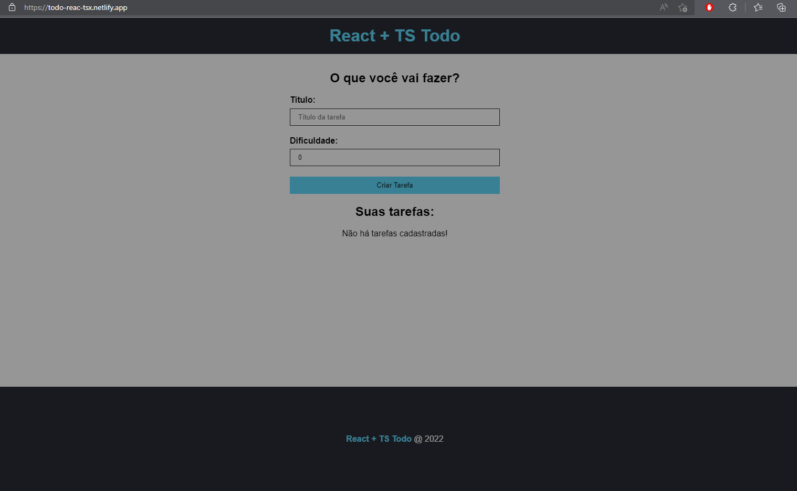

## Todo React + TS

#

### Funcionalidades

#

- Criar tarefa
  
- Editar tarefa
  
- Excluir tarefa
  

#

 

Tecnologias usadas.

- HTML
- CSS
- TypeScript
- React
- NodeJS

 
 

## Serviços Usados

#

- Github
- Netilify

   
   

# Como usar

## 1 - No terminal digite:

- git clone git@github.com:Brieffc/Todo-React-TS.git
- npm start

 
 

   
   

## Autor

Alisson Lopes

 

#

Obrigado pela visita! 
good coding.
